# Discord ChatGPT Bot Docker
---
### 簡介
這個專案是由 [Discord-ChatGPT-Bot](https://github.com/onury5506/Discord-ChatGPT-Bot) 分支出來的！

最近 ChatGPT 非常熱門，但也常常當機！或許你可以試試使用自己的 GPT 機器人！
使用這個 Docker 可以幫你節省時間快速在 Discord 架起自己的 GPT 機器人！

當然你有權利把自己的機器人加入到自己的伺服器跟它聊天，但當你要使用本專案時請注意查看說明！

---
### 機器人互動方式
##### 我們先介紹如何使用這個機器人！
它的啟動語是 `..` 和 `...` ，你可能會好奇他們之間的差異？
1. `..` 屬於你個人的 GPT 聊天室，簡單來說，這個會追蹤你和 GPT 的對話。此功能在與機器人的私訊中、伺服器的文字頻道中都能使用。
2. `...` 屬於 Discord 伺服器共有的 GPT 聊天室，這個會追蹤 Discord 伺服器任意文字頻道與 GPT 的對話。此功能只有在伺服器內說話能使用。

範例：
```
[與機器人的私訊中]
我： ..你是誰？
ChatGPT： 你好，我是 GPT-3。
我： ..以後請叫我「豆皮」。
ChatGPT： 好的，你是豆皮。
---
[在伺服器的文字頻道中]
我： ...你還記得我嗎？
ChatGPT(伺服器的)： 不好意思，你是誰啊？
我： ..再問一次，你知道我叫什麼嗎？
ChatGPT(私訊的)： 知道，你是豆皮。
```

##### 接著要教大家回朔對話：
你可能遇過一些問題，那就是你希望它變成某種形狀，但是它的回覆你不滿意，或是它陷入某種迴圈，一直跟你說類似的話。

這表示它因為之前的對話指示過於強烈或是不斷重複導致它定型，你會想要回到某句話，從那句話開始繼續對話。

這時請使用 Discord 的回應功能，對著你想回復定接續的對話按下右鍵（或用 App 長按）選擇 `回覆` ，接著照原本的使用方式跟他對話即可（記得使用啟動語）。

這個方法能夠讓你把私訊聊天的對話延續到伺服器頻道，並且使用 `...` 回覆它即可讓全伺服器的人接著你們的對話。

或者，你也可以用著種方法把別人的對話接到自己的私訊中，當你想回到猛一句時，不要忘記用 `回覆` 功能。

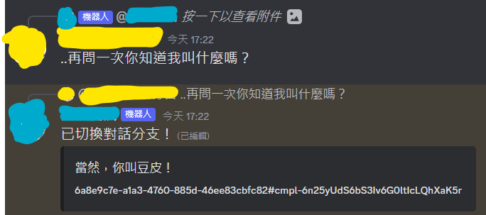

##### 開啟新的對話
使用 `..reset` 或 `...reset` 開啟全新的對話。

---
### 架設方法

#### Step 1. 準備
需要用到以下工具：

1. Docker
2. Discord
3. Discord Bot Token
4. OpenAI API Key
   
工具說明：

1. [Docker](https://zh.wikipedia.org/zh-tw/Docker) 是一個虛擬容器環境。使用 Windows / Mac 的用戶請下載 [Docker-Desktop](https://www.docker.com/)。
   Docker 允許我幫你們寫好配置文件，你們只需要在本地設定基本參數即可運行！

2. [Discord](https://zh.wikipedia.org/zh-tw/Discord) 原本是一款給工程師用的語音軟體，現在已經是許多遊戲愛好者使用的交友軟體了！請在[官網下載](https://discord.com/)，可以順便下載手機 app 方便你跟機器人聊天。

3. [Discord Bot Token](https://discord.com/developers/applications) 是每個想要架 DC 機器人都需要有的鑰匙！你可以在前往官網申請！
   

	步驟 1. 登入DC

	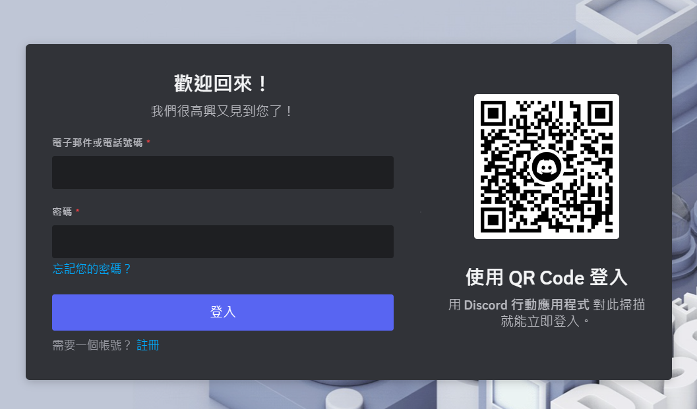

	步驟 2. 點擊右上的 New Application

	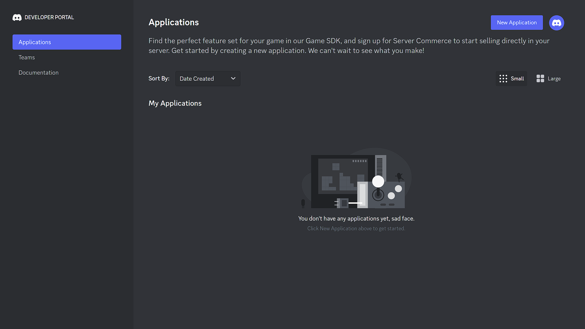 

	步驟 3. 幫機器人服務取名字

	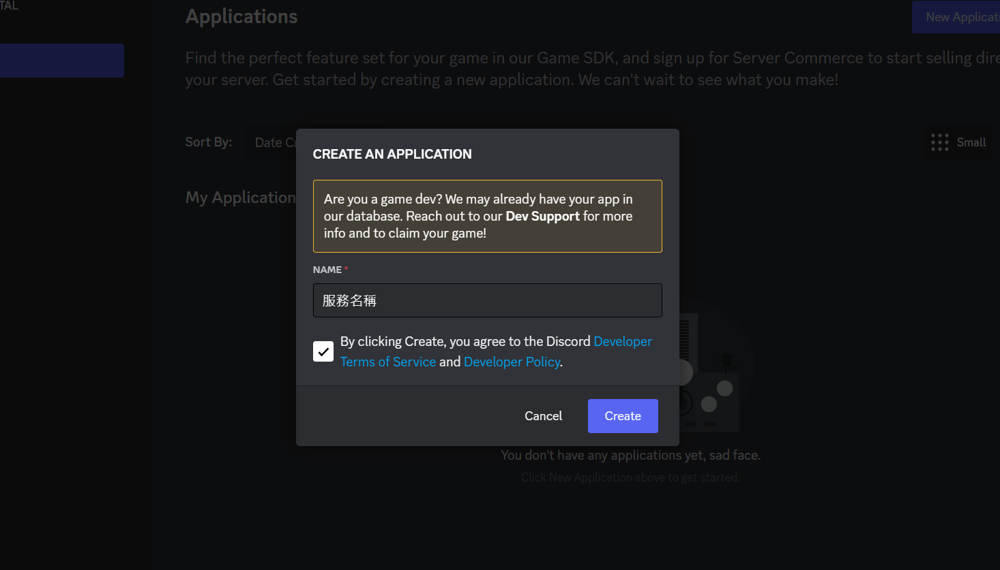 

	步驟 4. 點進你剛剛新增的應用服務

	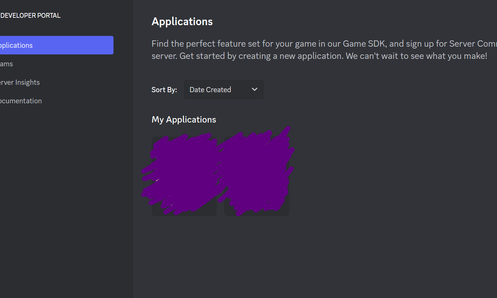

	步驟 5. 看到這格畫面後請點左邊的 Bot 按鈕

	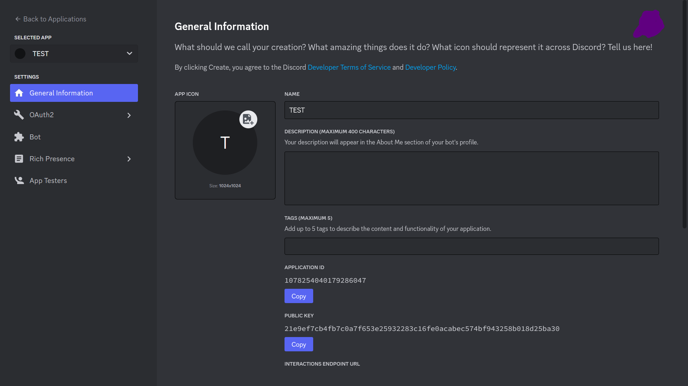 

	步驟 6. 進入後幫你的機器人取名字改頭貼

	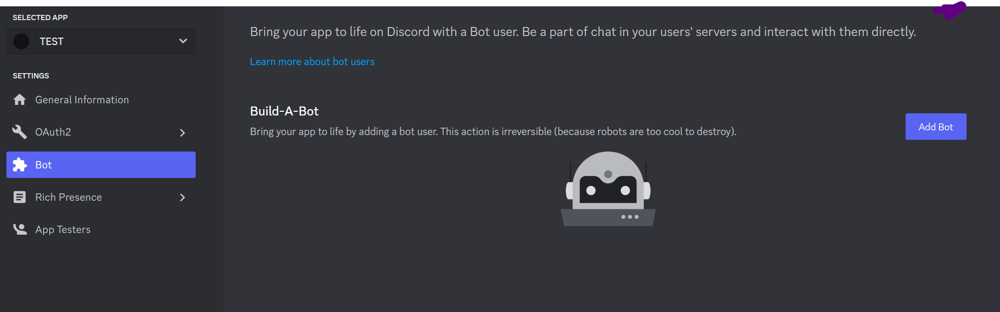 

	步驟 7. 完成後點擊 View Token，然後按 Copy

	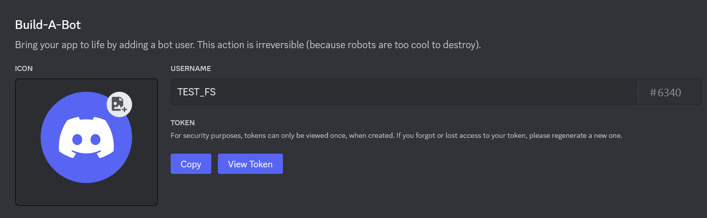 

	步驟 8. 往下滑除了 `Requires OAuth2 Code Grant` 以外，全部都把開關打開，第一個開關自己斟酌，如下圖。

	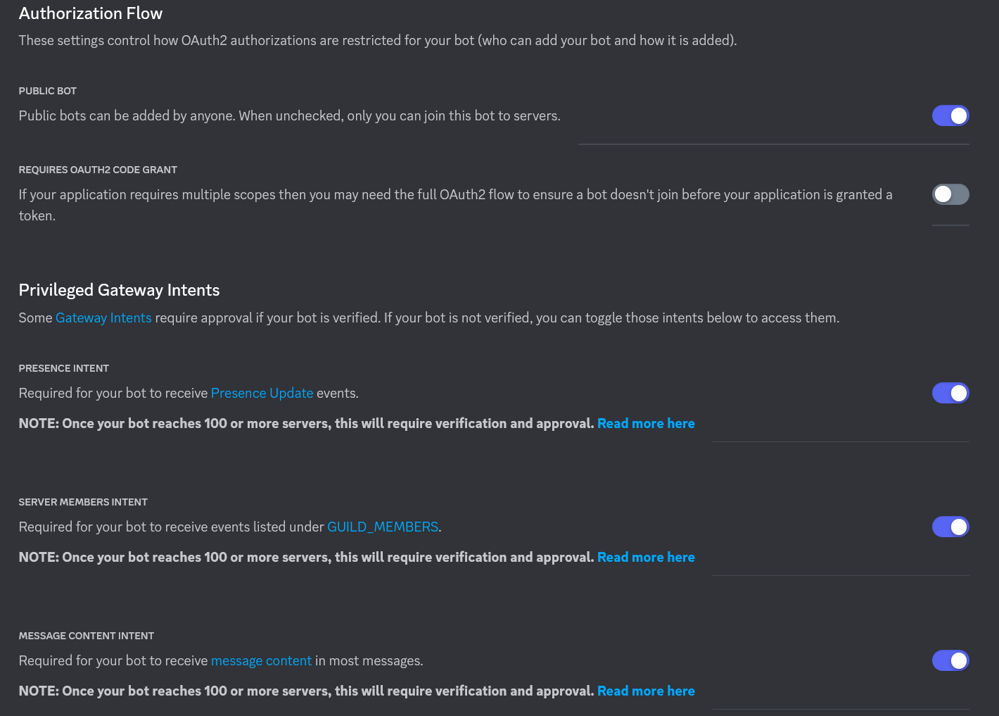 

	步驟 9. 把機器人加入自己的伺服器，點擊左側 OAuth2 ，點 URL Generator。

	勾起 `bot` ，下面的 `Administrator` 自己決定要不要給管理權限。
	選完後下方會出現要請連結，複製後用新的瀏覽器分頁開啟並加入。
	或者修改使用下面這串 URL（[參考資料](https://discordjs.guide/preparations/adding-your-bot-to-servers.html#bot-invite-links)）：

	```
	https://discord.com/api/oauth2/authorize?client_id=[你的機器人id]&permissions=8&scope=bot
	```

	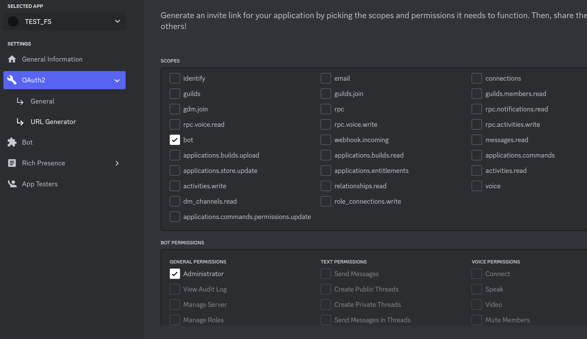 

	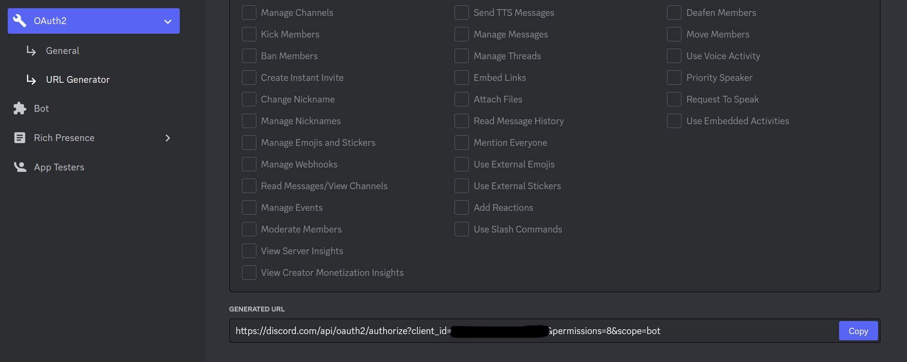 
	完成 Token 申請！

4. [OpenAI API Key](https://platform.openai.com/account/api-keys)，這組鑰匙可以讓你連接你的 ChatGPT ，請保管好不要給他人使用！

	步驟 1. 點擊這個[連結](https://platform.openai.com/account/api-keys)申請，登入你的帳號
	步驟 2. 點擊 Create new secret key，複製下 Key。

	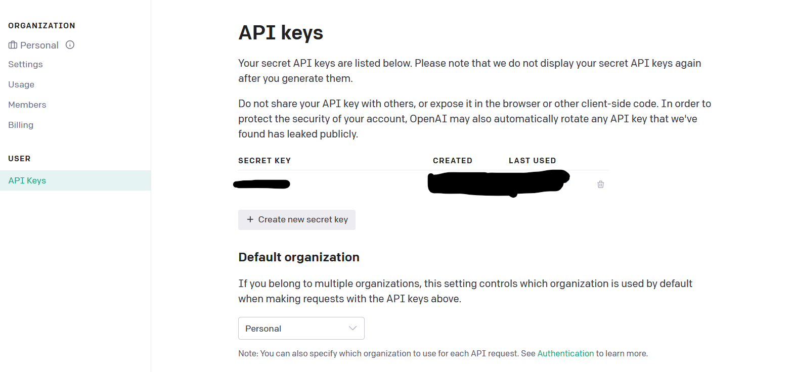 
	完成！

#### Step 2. 配置環境參數
可以從[這裡](https://github.com/suzumiyahifumi/Discord-ChatGPT-Bot-docker/releases)下載我整理好的配置文件跟程式碼。
之後請照著說明填寫配置文件！

下載後在根資料夾有一個名為 ```.env.example``` 的檔案。
它是一個隱藏檔案，如果看不到表示你的電腦需要開啟顯示隱藏檔案。

Mac 請使用快捷鍵 ```Shift + Command + .```

winsows 請在檔案管理員裡面勾起顯示

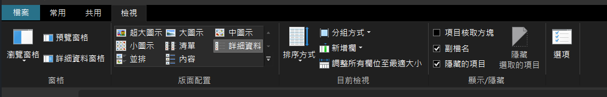

看到 ```.env.example``` 請複製一份或者直接改名為 ```.env```

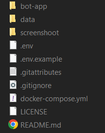

使用任何的編輯器，例如 筆記本、Notepad、Notepad++ 等開啟 ```.env```
開始把各設定 `=` 後面的參數換成你的，注意中間都沒有空格。
完成後儲存關閉檔案。
```yml
#填入你喜歡的資料庫帳號
MONGODB_USER=root
#填入你喜歡的資料庫密碼
MONGODB_PASSWORD=123456
#填入你喜歡的資料庫名稱
MONGODB_DATABASE=gptbot_db
#不重要，資料庫在 Docker 內的 PORT
MONGODB_DOCKER_PORT=27017
#填入你的 Discord Token，這串是亂打的
DISCORD_BOT_TOKEN=Oahia938ngla83hnlaiw83mao.fch34k.ijhihrwo392nfDOWjHIe93Qmfow
#填入你的 API Key，這串是亂打的
OPENAI_API_KEY=dt-fjhi3OhoehUpwQ07m62mmo9amowYWiahf82ma9vojsDojOF7d
#這會決定你的對話會在你未回覆訊息的幾秒後結束追蹤，預設１天，有跟他說話就沒事
CONVERSATION_MEMORY_SECONDS=86400
```

接下來我們開啟終端機，如果你有在寫程式，可以用自己喜歡的終端機。

windows 用戶可以對著本專案資料夾任意空白處 ```shift + 右鍵``` 你會看到 ```在這裡開啟 powershell 視窗(S)``` 點下去。

接著輸入 ```docker-compose up``` ，下面這是示意圖。
```console
PS ~\Discord-ChatGPT-Bot-docker> docker-compose up
```
如果不想看到一堆雜七雜八的東西可以用 ```docker-compose up -d``` 讓它在背景跑。建議第一次啟動使用 ```docker-compose up```

等它跑完應該就部屬完成了，去找你的機器人聊天吧！

想要關閉機器人請輸入 ```docker-compose down``` 關閉。
如果卡在執行面版，請按 ```ctrl + C``` 退出並關閉。

成功建置的話，打開 `Docker-Desktop` 記可以看到他正在運行。
之後可以在 `Docker-Desktop` 中控制開關。在 `Container` 中你會看到 `discord-chatgpt-bot-docker` 後面有 `暫停` 與 `起動` 按鈕。

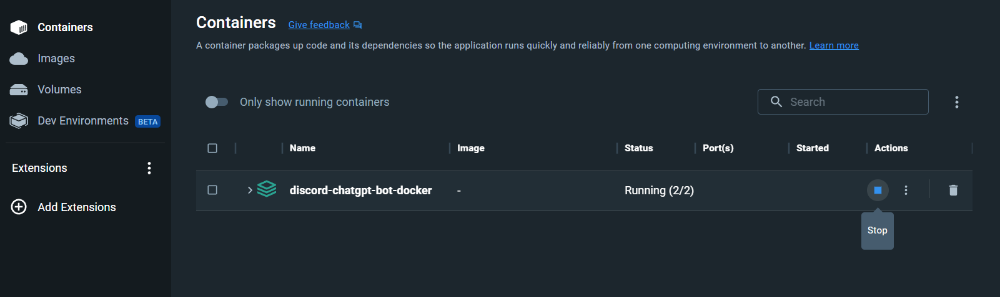

點開 `discord-chatgpt-bot-docker` 後可以點 `app-1` 會跳出後台可以查看。

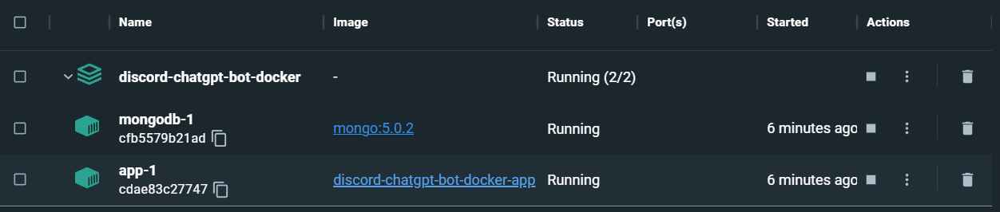
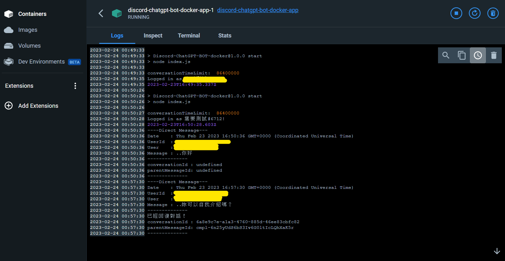
